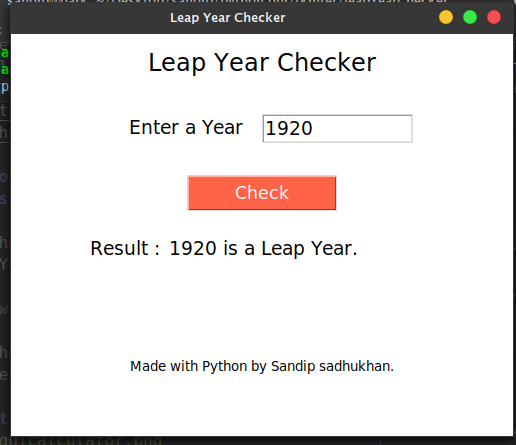

# Leap Year Checker App
This is a Gui calculator tool developed by [sandip Sadhukhan](https://yourwebsite.github.io/) with **python**.

## Requirement
* python 3
## Download the Tool
go to your terminal or Command Prompt and write the following commands
```bash
git clone https://github.com/sandipsadhukhan/leapyearchecker.git
```
## Run the Tool
### On Mac os/Linux
```bash
cd leapyearchecker
python3 leapYearChecker.py
```
### On Windows
```bash
cd leapyearchecker
python leapYearChecker.py
```
## Screenshot


## How to Use
1. Write the value of year in the box.
2. Click Check Button for result

## Feature
* [x] Simple GUI to check a year is leap year or not.

---
### Contact with Developer
Email : sandip.sendme@gmail.com

---
### Suggestions for future upgrade
- Use Live API
- Use Django api at backend
---
### Sponsors
<a href="https://www.youtube.com/channel/UCrgmUws8p-fPcIFZJsdenaQ"></a>
